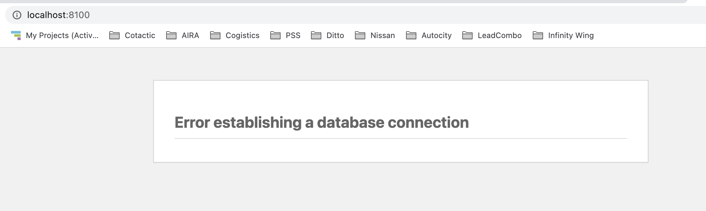
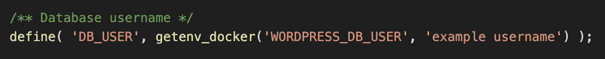

this repo contain how to fix
``why my wordpress docker compose is not work``

1. wordpress use default config `WORDPRESS_DB_USER` as `example username`

2. wordpress require to create database `WORDPRESS_DB_NAME` before start

## reference
 - https://hub.docker.com/_/mariadb
 - https://hub.docker.com/_/wordpress